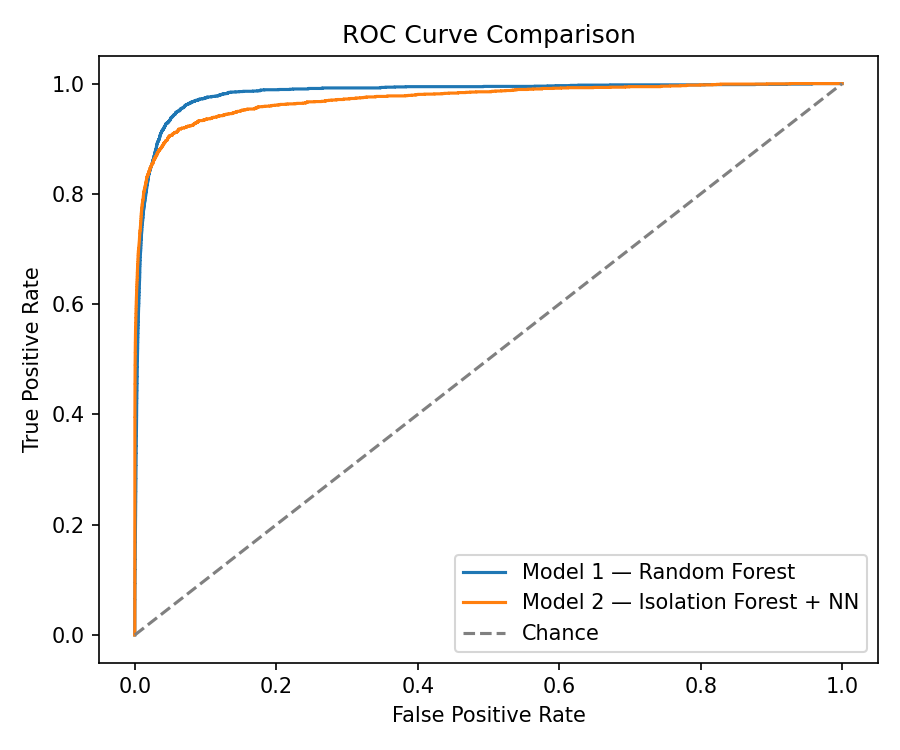
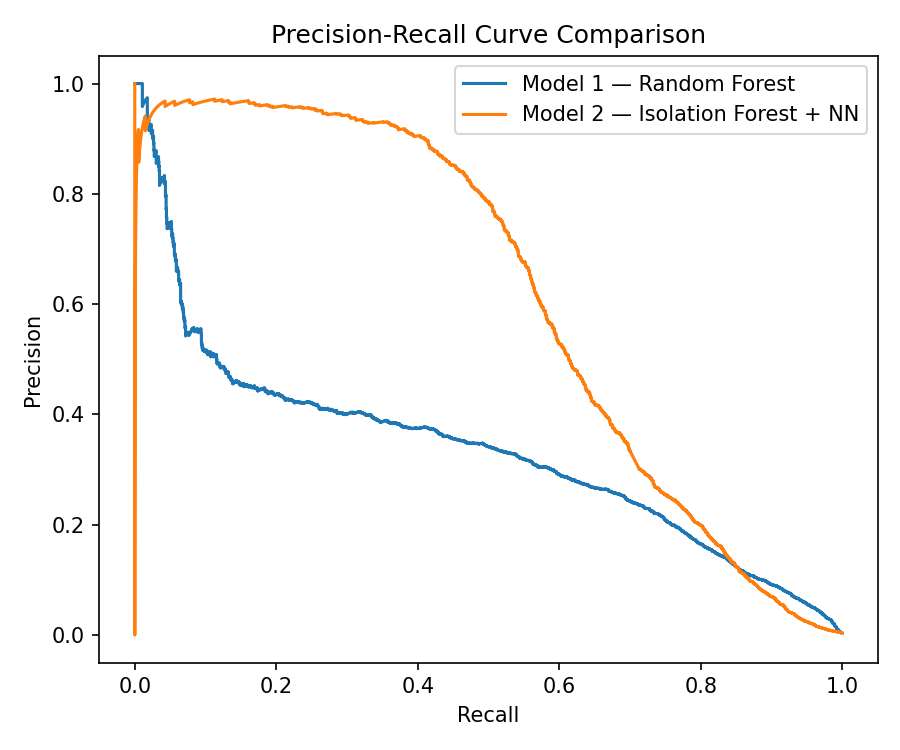

# Model Comparison — Model 1 vs Model 2

**Script:** [`src/compare_models.py`](src/compare_models.py)
(shared helpers in [`src/metrics_utils.py`](src/metrics_utils.py))

These results are from the **real dataset** described in Part A — both
models were trained and evaluated on the full 1,296,675-row training set
and 555,719-row test set from the "Credit Card Transactions Fraud
Detection Dataset" (Shenoy, 2020).

## What it does

Requires `model1_performance.py` and `model2_performance.py` to have
already been run (it reads their saved `reports/model1_predictions.csv`
and `reports/model2_predictions.csv`). It then runs **two complementary
statistical comparisons**, because they answer different questions:

### 1. McNemar's test — comparing hard decisions

At the default 0.5 threshold, each model gets each test transaction either
right or wrong. McNemar's test builds a 2×2 contingency table of "both
right / only Model 1 right / only Model 2 right / both wrong" and tests
whether the disagreements are lopsided in one model's favour, more than
chance alone would produce. This is the standard **paired** significance
test for two classifiers evaluated on the *same* test set (a plain t-test
would wrongly assume the two models' errors are independent samples, when
they're actually paired — same transactions, same true labels).

The chi-squared version (with continuity correction) is used automatically
here, since the number of disagreement cases is large (>25).

### 2. Paired bootstrap test — comparing probability rankings

McNemar's test only looks at one threshold. The paired bootstrap instead
resamples the test set (with replacement) 200 times, and for each
resample computes the *difference* in PR-AUC (and separately, ROC-AUC)
between Model 1 and Model 2 using the **same resampled rows for both
models** (this pairing is what makes it a valid comparison, rather than
comparing two independent bootstrap distributions). This gives:
- A 95% confidence interval on the *size* of the performance gap, not
  just whether one exists.
- An approximate two-sided p-value for the null hypothesis that the true
  PR-AUC/ROC-AUC difference is zero.

## How to run

```bash
# Run both performance scripts first if you haven't already:
python src/model1_performance.py --model models/model1_random_forest.joblib \
    --test data/processed/test_features.csv --output-dir reports --n-boot 200
python src/model2_performance.py --iso-model models/model2_isolation_forest.joblib \
    --nn-model models/model2_neural_network.keras \
    --test data/processed/test_features.csv --output-dir reports --n-boot 200

# Then compare:
python src/compare_models.py \
    --model1-predictions reports/model1_predictions.csv \
    --model2-predictions reports/model2_predictions.csv \
    --output-dir reports --n-boot 200
```

**Outputs** (written to `reports/`):
- `comparison_table.csv` — side-by-side metrics table
- `comparison_results.json` — McNemar's test and paired bootstrap results
- `comparison_roc_curves.png`, `comparison_pr_curves.png` — both models
  overlaid on the same axes

## Results

| Metric | Model 1 (Random Forest) | Model 2 (Isolation Forest + NN) |
|---|---|---|
| Precision | 0.2607 | 0.3538 |
| Recall | 0.6718 | 0.6918 |
| F1 | 0.3757 | 0.4681 |
| ROC-AUC | 0.9829 | 0.9723 |
| PR-AUC | 0.3352 | 0.6149 |

**McNemar's test** (threshold-0.5 decisions): both-correct = 549,260,
Model 1-only-correct = 1,669, Model 2-only-correct = 3,087, both-wrong =
1,703. χ² = 422.18, **p = 8.18 × 10⁻⁹⁴** (highly significant at α=0.05) —
Model 2 corrects almost twice as many of Model 1's mistakes as the other
way around.

**Paired bootstrap, PR-AUC (Model 1 − Model 2):** observed difference =
−0.2797, 95% CI [−0.2980, −0.2603], p ≈ 0.000 — Model 2's PR-AUC is
significantly and substantially higher.

**Paired bootstrap, ROC-AUC (Model 1 − Model 2):** observed difference =
+0.0106, 95% CI [0.0078, 0.0138], p ≈ 0.000 — Model 1's ROC-AUC is
significantly, but only marginally, higher.

### Interpretation

All three tests agree on the substantive conclusion, but tell different
parts of the story:

- **McNemar's test** confirms Model 2 is the stronger classifier at the
  practical 0.5 decision threshold: it gets right almost twice as many of
  the disagreement cases as Model 1 does (3,087 vs 1,669), and the
  difference is overwhelmingly statistically significant.
- **PR-AUC** confirms this holds across the whole range of thresholds, not
  just at 0.5 — Model 2's PR-AUC of 0.615 vs Model 1's 0.335 is a large,
  tightly-bounded, statistically significant gap.
- **ROC-AUC very slightly favours Model 1** (0.983 vs 0.972), and this
  difference is also statistically significant despite being small in
  absolute terms — but ROC-AUC is the less trustworthy metric here. It
  weighs performance on the (very large) legitimate class heavily, which
  can make it look similar or even favour a weaker model on the
  *fraud* class specifically when fraud is this rare (0.386% of the test
  set). PR-AUC, precision/recall, and McNemar's test — which all focus on
  how the models handle the positive (fraud) class — unanimously favour
  Model 2.

**Overall conclusion**: Model 2 (the hybrid Isolation Forest + Neural
Network) is the better-performing model for this task, and the advantage
is real, large, and statistically significant on every metric that
actually reflects fraud-detection quality on an imbalanced dataset. Model
1's marginally higher ROC-AUC does not outweigh this — it is a case where
the "headline" metric is less informative than the imbalance-aware ones,
which is exactly the trap the Part A literature review flagged (several
of the reviewed papers explicitly warned against relying on accuracy or
ROC-AUC alone on imbalanced fraud data). For a production STADIOalot
deployment, **Model 2 would be the recommended choice**, particularly at
its F1-optimal threshold (75% precision at 52% recall — see
[Model2Performance.MD](Model2Performance.MD)), which would generate far
fewer false alarms for a manual fraud-review team to work through than
Model 1's equivalent operating point.



