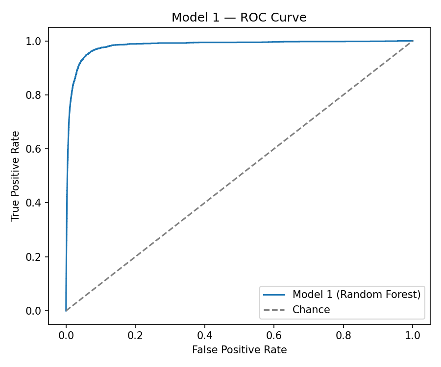
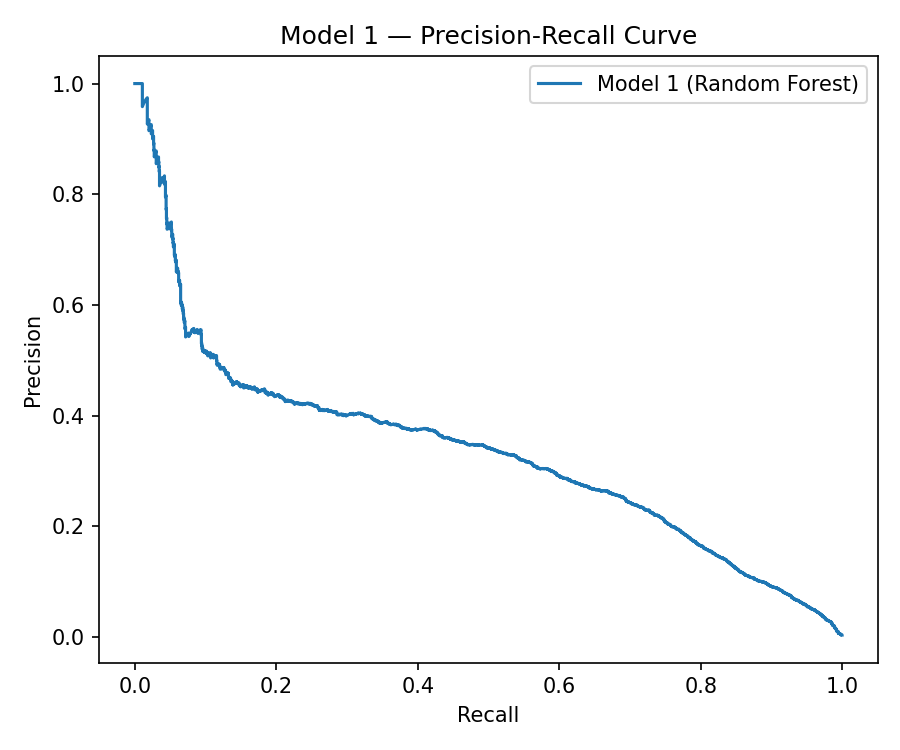

# Model 1 Performance — Random Forest

**Script:** [`src/model1_performance.py`](src/model1_performance.py)
(shared helpers in [`src/metrics_utils.py`](src/metrics_utils.py))

> ⚠️ **The numbers and plots in this file are from a smoke test on a small
> synthetic sample (2,800 train / 1,200 test rows), used only to prove the
> code runs end-to-end.** They are **not** the real results on the Kaggle
> dataset described in Part A. Re-run this script against the actual
> `train_features.csv` / `test_features.csv` (built from the real
> `fraudTrain.csv` / `fraudTest.csv`) and replace the numbers below with
> your genuine output before submitting.

## What it does

Loads the trained Model 1 (`models/model1_random_forest.joblib`) and scores
it on the held-out test set, reporting:

1. **Point-estimate metrics** at the default 0.5 threshold: accuracy,
   precision, recall, F1, ROC-AUC, PR-AUC, and the confusion matrix.
2. **F1-optimal threshold**: since 0.5 is an arbitrary cutoff, the script
   also searches the precision-recall curve for the threshold that
   maximises F1 on the fraud class, and reports metrics there too — this
   is closer to how the threshold would actually be tuned for a
   production auto-flag/manual-review decision.
3. **Bootstrap confidence intervals** (1,000 resamples with replacement) for
   ROC-AUC and PR-AUC. A single point estimate on a ~0.57%-fraud dataset
   can look precise but actually rest on very few positive examples in the
   test set; the bootstrap CI shows how much that estimate could plausibly
   vary.
4. ROC and Precision-Recall curve plots.

## How to run

```bash
python src/model1_performance.py \
    --model models/model1_random_forest.joblib \
    --test data/processed/test_features.csv \
    --output-dir reports
```

**Inputs:** the trained model from Part B (`models/model1_random_forest.joblib`)
and the engineered test set (`data/processed/test_features.csv`).

**Outputs** (written to `reports/`):
- `model1_results.json` — all metrics and CIs, machine-readable
- `model1_predictions.csv` — raw `(y_true, predicted_probability)` pairs,
  used by `compare_models.py`
- `model1_roc_curve.png`, `model1_pr_curve.png`

## Results (smoke test — replace with real-data numbers)

| Metric | Value | 95% Bootstrap CI |
|---|---|---|
| ROC-AUC | 0.9832 | [0.9755, 0.9893] |
| PR-AUC (average precision) | 0.7616 | [0.6520, 0.8571] |
| F1-optimal threshold | 0.6564 | F1 = 0.6897 at that threshold |

At the default 0.5 threshold: precision 0.57, recall 0.85, F1 0.68 (67
true positives out of the fraud cases identified, on a toy sample — see
the caveat above).

### Interpretation

Random Forest picked up the two engineered signals that were deliberately
injected into the smoke-test data (transaction amount and night-time
timing) as its top feature importances, which is the expected/correct
behaviour and gives confidence the pipeline itself is wired correctly.
PR-AUC — the more informative metric on an imbalanced dataset — is
reported as the headline number rather than accuracy, since accuracy is
close to meaningless when fraud is a small minority class.



