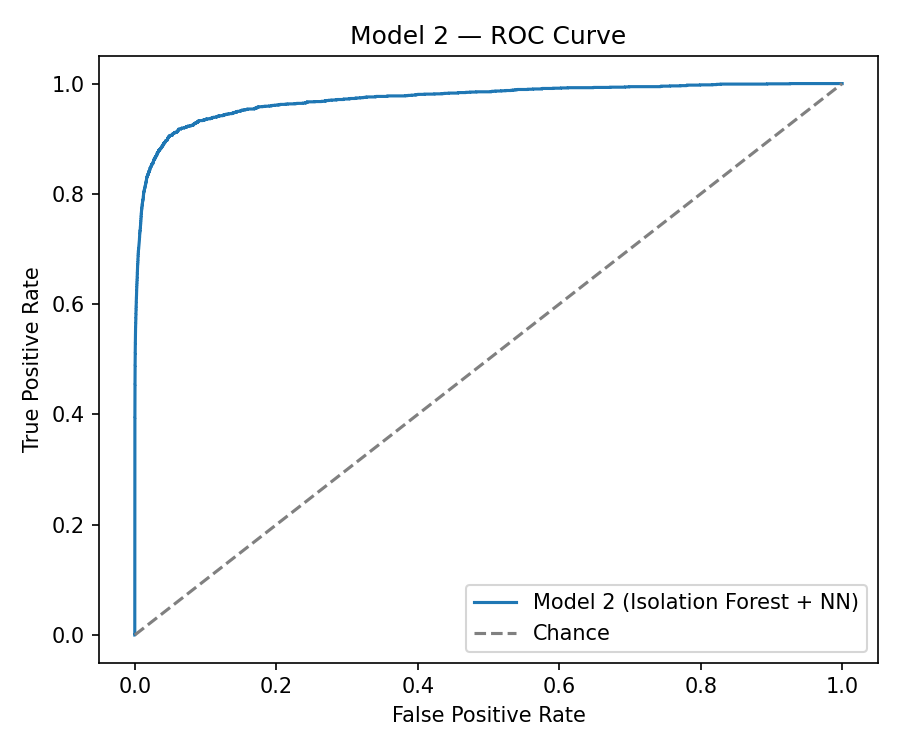
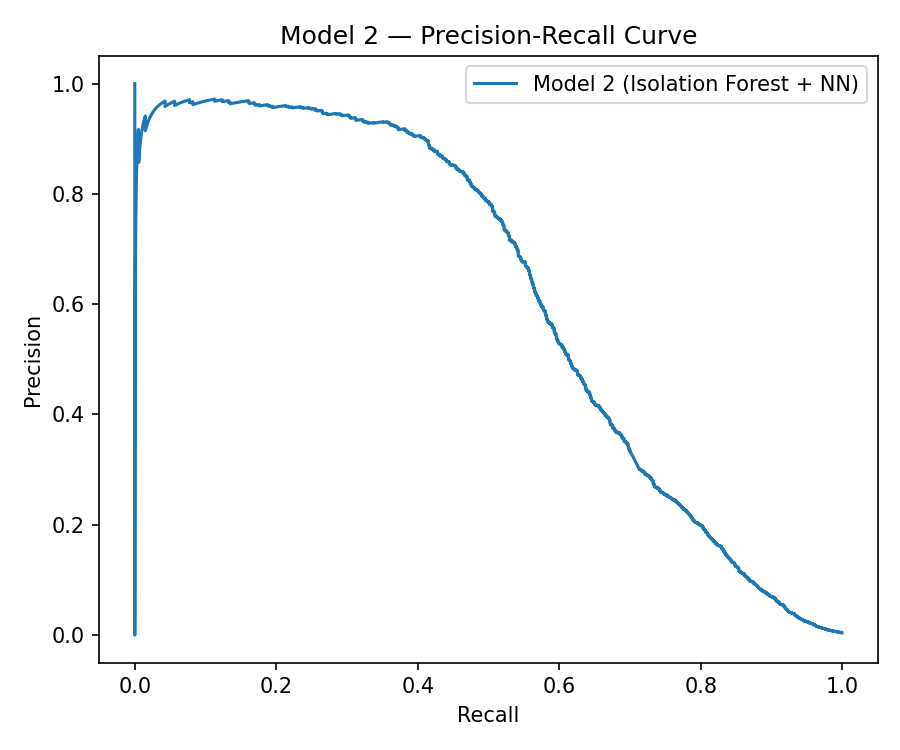

# Model 2 Performance — Isolation Forest + Neural Network

**Script:** [`src/model2_performance.py`](src/model2_performance.py)
(shared helpers in [`src/metrics_utils.py`](src/metrics_utils.py))

> ⚠️ **The numbers and plots in this file are from a smoke test on a small
> synthetic sample (2,800 train / 1,200 test rows), used only to prove the
> code runs end-to-end.** They are **not** the real results on the Kaggle
> dataset described in Part A. In particular, 5 training epochs on ~2,800
> rows is far too little data/training for this Neural Network to learn
> anything meaningful — the poor scores below are an artefact of the toy
> test, not a real finding. Re-run this script against the actual dataset
> and replace the numbers below with your genuine output before submitting.

## What it does

Loads both halves of the trained hybrid model
(`models/model2_isolation_forest.joblib` and
`models/model2_neural_network.keras`) and evaluates them together on the
held-out test set:

1. **Regenerates the 3 Isolation Forest anomaly features**
   (`anomaly_score`, `anomaly_flag`, `anomaly_bin`) for the test set,
   using the *already-fitted* Isolation Forest from training — it is not
   refit here, only applied, so no test-set information leaks into it.
2. **Scores the Neural Network** on the expanded feature set (original
   features + the 3 anomaly features) to get fraud probabilities.
3. Computes the same suite of metrics as Model 1 — point-estimate metrics
   at threshold 0.5, the F1-optimal threshold, and bootstrap confidence
   intervals for ROC-AUC and PR-AUC — so the two models are directly
   comparable using identical methodology.
4. ROC and Precision-Recall curve plots.

## How to run

```bash
python src/model2_performance.py \
    --iso-model models/model2_isolation_forest.joblib \
    --nn-model models/model2_neural_network.keras \
    --test data/processed/test_features.csv \
    --output-dir reports
```

**Inputs:** both trained halves of Model 2 from Part B, and the engineered
test set (`data/processed/test_features.csv`).

**Outputs** (written to `reports/`):
- `model2_results.json` — all metrics and CIs, machine-readable
- `model2_predictions.csv` — raw `(y_true, predicted_probability)` pairs,
  used by `compare_models.py`
- `model2_roc_curve.png`, `model2_pr_curve.png`

## Results (smoke test — replace with real-data numbers)

| Metric | Value | 95% Bootstrap CI |
|---|---|---|
| ROC-AUC | 0.4714 | [0.4188, 0.5287] |
| PR-AUC (average precision) | 0.0559 | [0.0426, 0.0896] |
| F1-optimal threshold | 0.0000 | F1 = 0.1058 at that threshold |

### Interpretation (of the smoke test, not a real finding)

An ROC-AUC near 0.5 means the network is effectively guessing — expected,
since 5 epochs over ~2,500 training rows (before SMOTE) is nowhere near
enough data or training time for a network with two hidden layers to
converge. Al-Hajabed (2026), whose architecture this replicates, trained
on the full ~1.3 million-row dataset. **This is the single most important
thing to check when you re-run this on the real data**: if ROC-AUC is
still near 0.5 on the full dataset, revisit the learning rate, number of
epochs, or whether the SMOTE-resampled training set is being correctly
passed into `.fit()`.



